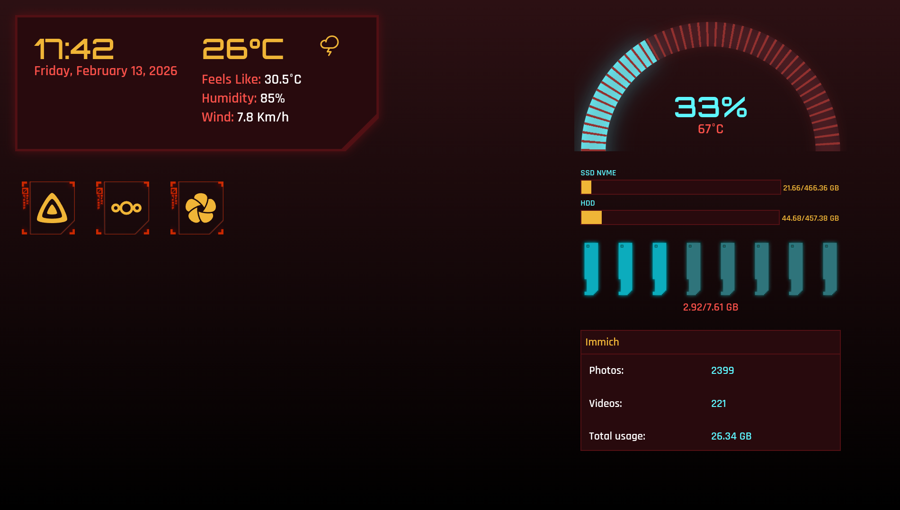

# homelab-dashboard
A dinamic, **Cyberpunk 2077-inspired** dashboard destinated to homelabs. Monitor your hardware, quickly acess your Docker containers, and keep track of your stacks info

## ✨ Features

* **Real-time Monitoring:** Smooth SVG-based CPU and RAM gauges.
* **Docker Integration:** Automatically fetches containers labeled with `dash.enable=true`.
* **Immich Stats:** Direct integration to show your total photos, videos, and storage usage.
* **Weather Overlay:** Real-time weather data based on your location.
* **Cyberpunk Aesthetic:** High-contrast design based on Cyberpunk 2077's UI

---

## 🛠️ Tech Stack

* **Frontend:** Vanilla JS, CSS3 (with custom SVG animations), HTML5.
* **Backend:** Node.js, Express.
* **APIs:** Dockerode (Docker Socket), Systeminformation, Open-Meteo, Immich API.
* **Infrastructure:** Docker & Docker Compose.

---

## 🚀 Getting Started

### Prerequisites

* Docker and Docker Compose installed.

### 1. Clone the repository

```bash
git clone https://github.com/Everton312/homelab-dashboard.git
cd homelab-dashboard

```

### 2. Configuration

The project is designed to be **IP-agnostic**. You need to set up your configuration files:

**Frontend Config:**

```bash
cp front/config.example.js front/config.js

```

Edit `front/config.js` and ensure it points to your server's hostname or IP.

**Backend Environment:**
Create a `.env` file in the `back/` folder:

```env
PORT=3001
DOCKER_SOCKET=/var/run/docker.sock

```

### 3. Label your Containers

For a container to appear on the dashboard, add these labels to your `docker-compose.yml` files:

```yaml
labels:
  - "dash.enable=true"
  - "dash.name= Container name"
  - "dash.port=8096"
  - "dash.icon= " # SimpleIcons slug

```

### 4. Run with Docker Compose

```bash
docker-compose up -d

```

---

## 💡 Pro Tips & Troubleshooting

### 🏎️ Intel Hardware Transcoding (Jellyfin/Plex)

If you are using an Intel CPU (like the i3-8100T) and facing transcoding issues in Docker (like I had), ensure your user has permission to access the GPU.

1. Find your `render` group ID: `getent group render | cut -d: -f3`
2. Add it to your `docker-compose.yml`:

```yaml
devices:
  - /dev/dri:/dev/dri
group_add:
  - "993" # Replace with your ID
